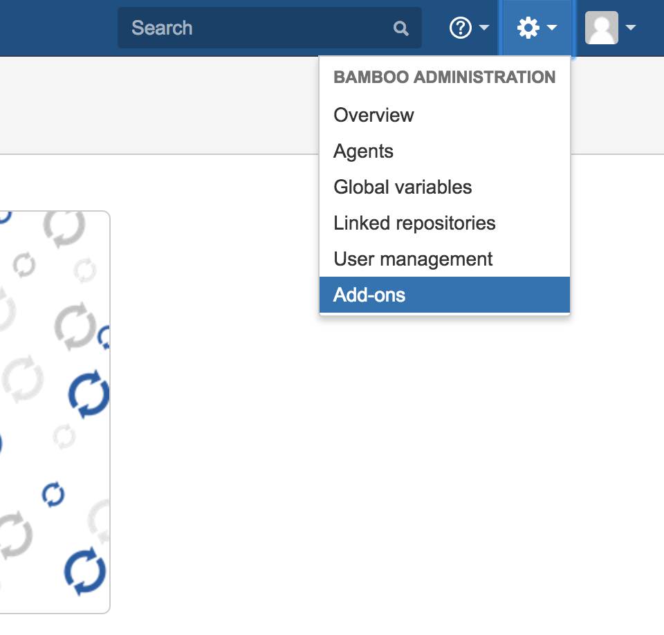
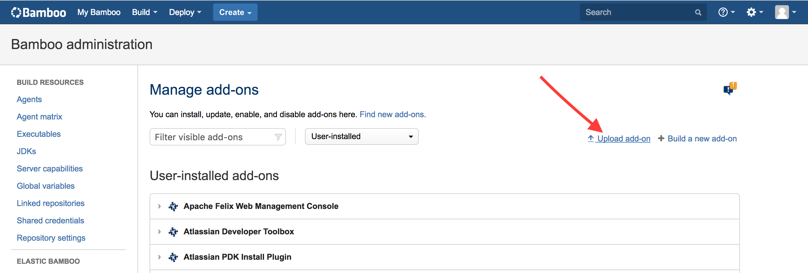
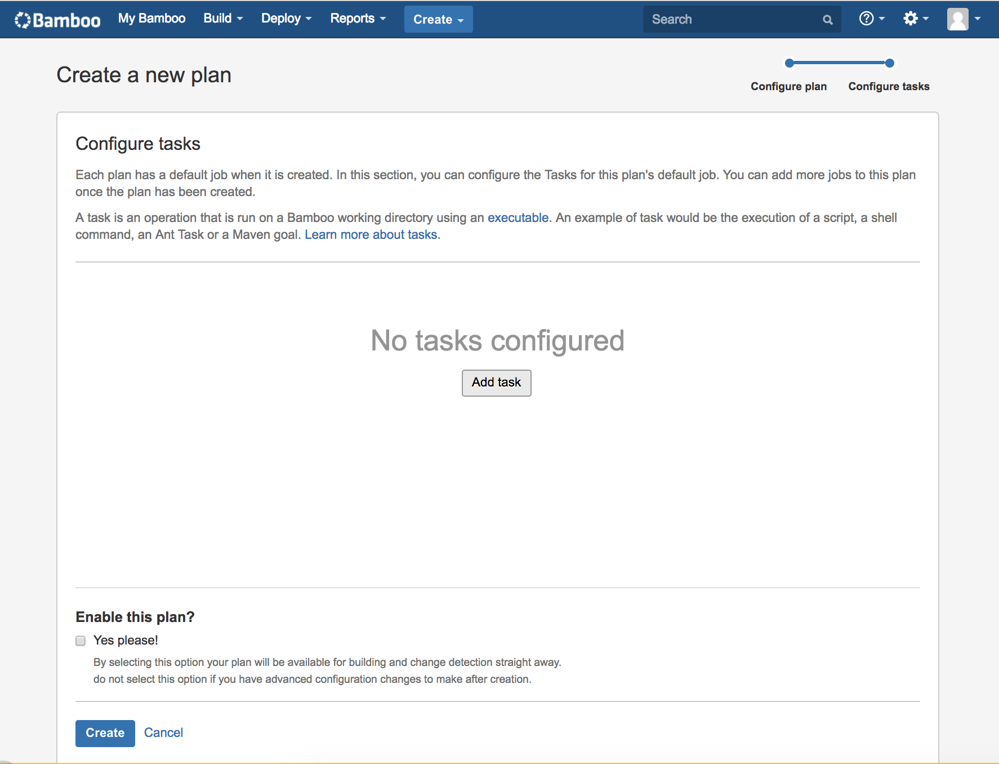
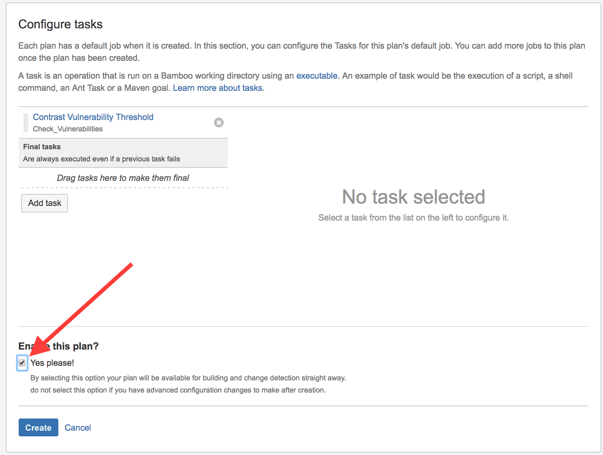
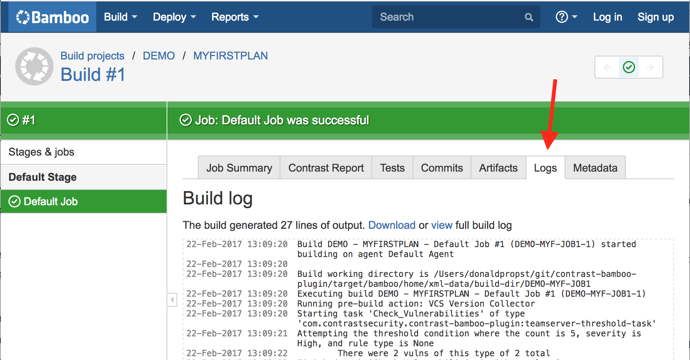
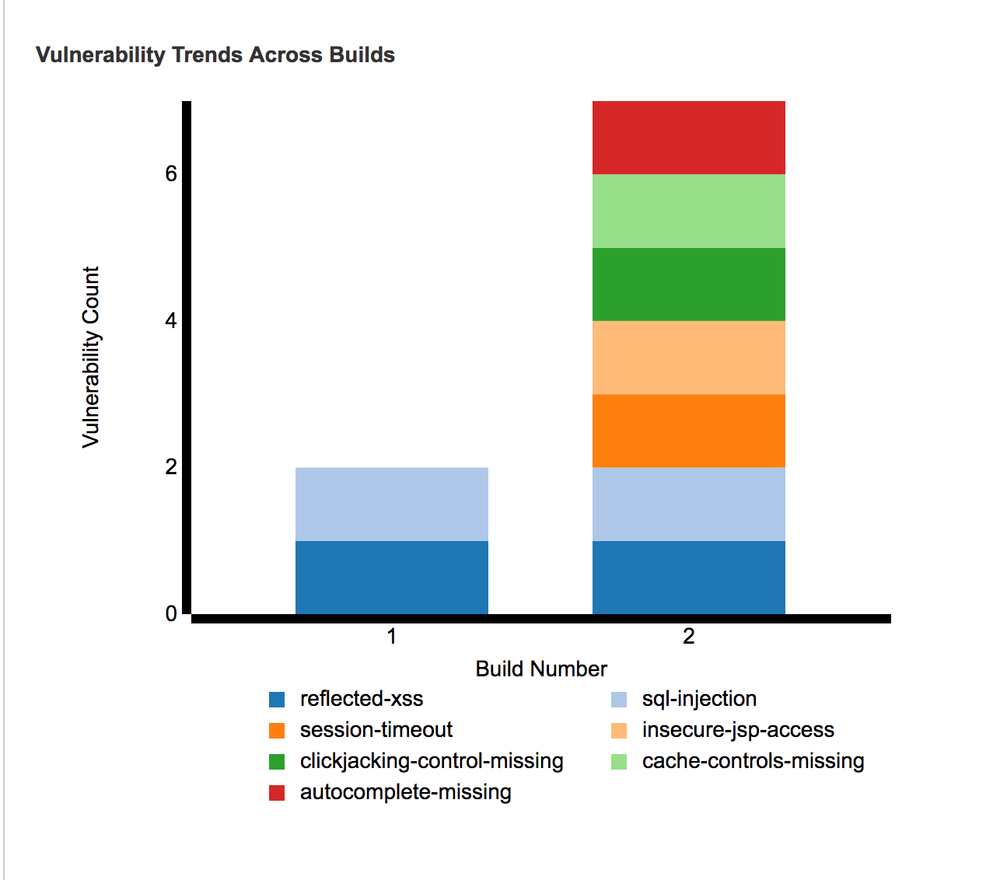

This plugin adds functionality to Bamboo so that you can configure profiles for connecting to Contrast and verify builds against vulnerability thresholds.

## Install the Plugin
The first step is to build the plugin. To begin, clone the plugin from our Github [repository](https://github.com/Contrast-Security-OSS/contrast-bamboo-plugin.git).
```bash
git clone https://github.com/Contrast-Security-OSS/contrast-bamboo-plugin.git
cd contrast-bamboo-plugin
mvn package
```

This builds the *contrast-bamboo-plugin-#.#.#-SNAPSHOT.jar* and the *a .obr* file. They can both be found within the *contrast-bamboo-plugin/target* directory of the cloned project.

Once you have built the plugin, you can upload it to your Bamboo instance. Begin by selecting the **Add-Ons** option from the top left settings menu.




Then select the **Upload add-on** link.



You should now be prompted to upload a file. Select *contrast-bamboo-plugin-#.#.#-SNAPSHOT.obr*.

After uploading the plugin, you should see it appear under **User Installed Add-Ons**.


### Create a Contrast profile
To use the plugin, you should first configure a Contrast profile. To do this, select the **Contrast Profiles** button under **Add-Ons** within the **Bamboo Administration** dashboard.


You'll then be brought to the **Profile Configuration** page. Select the **New Profile** button to see fields for adding a profile.

Fill out the form fields according to their labels.
If you are a SaaS customer you do **not** need to enter a Contrast URL. Once you have filled out all the fields, select the **Test Connection** button to verify that your settings are correct.


## Vulnerability Thresholds
The plugin can be added as a task to build jobs to check for vulnerability conditions that you configure. This checks Contrast for the number of vulnerabilities in the applications as well as types of vulnerabilities.

### Configure vulnerability thresholds
To add a task to a build job, you must either create a new plan or use an existing build plan. For the purpose of these instructions, you'll walk through creating a new build plan.

Select the **Create a New Build Plan** button.


You'll now be prompted to give the build plan a project name, plan name and link to the repository host. The project key and plan key is auto-generated.


Once you create the plan, add a task to the build process by clicking the **Add Task** button.



A dialog will appear. Find the **Contrast CI for Assess** task and select it.


The Tasks configuration screen relies on a Contrast profile, which you configured in the previous steps, as well as a server name, application name and a **Passive** parameter. The server name isn't required, but should correspond to a server name in Contrast if used. The application name must be on the designated server.

If you select the **Passive** parameter, the plugin will query all vulnerabilities, not only build-specific vulnerabilities, for the application. In this case, there is no need to run the application with its integration tests before the Contrast post-build action in the Bamboo build.

The next part of the task configuration is defining conditions for when to fail a build. This involves entering three pieces of data:

* **Threshold Count:** The minimum number of findings required to fail the build.
* **Threshold Severity:** The minimum severity at which to count a finding towards the threshold count.
* **Threshold Vulnerability Type:** The type of finding required to count a finding towards a threshold count.

>**Note:** Using the **Any** option means that any severity or vulnerability type is counted towards the maximum threshold count.

You can configure multiple conditions for each task by selecting the **Add New Threshold Condition** button.


The last step is to enable the build plan by selecting the checkbox in the bottom left.



### Run the build
To run your build for the first time, you'll need to select the **Run** button and then in the dropdown select the **Run Plan** option.

Once the build is finished, you can see if it passed or failed. To view the Contrast task details, look at the logs of the job to which the task is attached. In the following example, this is the default job. As you can see in the logs, the task only found two vulnerabilities that met your conditions, therefore the job passes.



You can also see charts of data from the task by clicking the **Contrast Report** tab. This presents the past 10 builds and charts the severities over build numbers, as well as the vulnerability types of build numbers.


