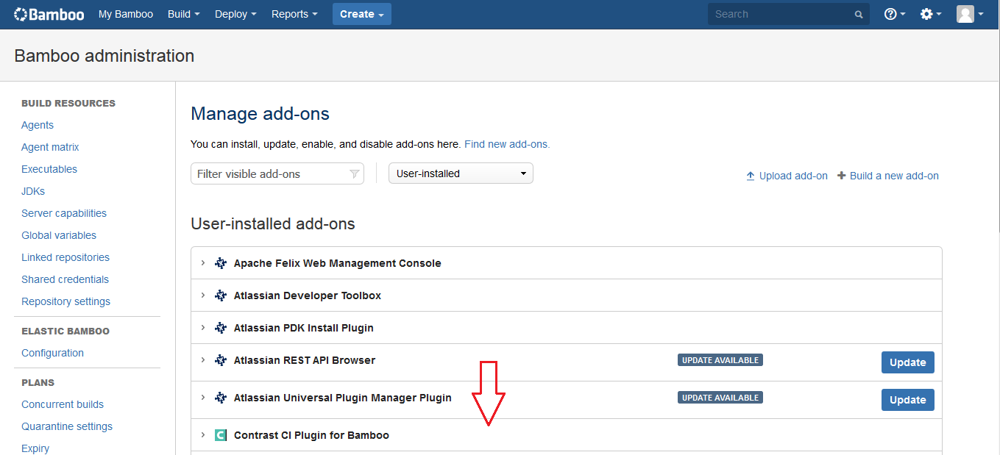
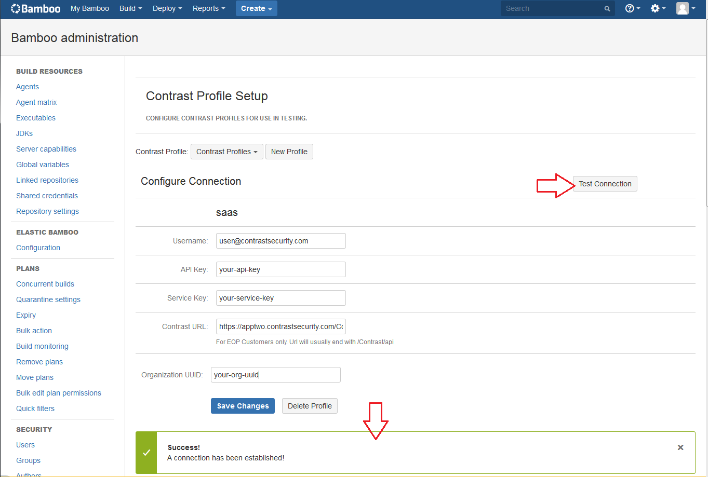
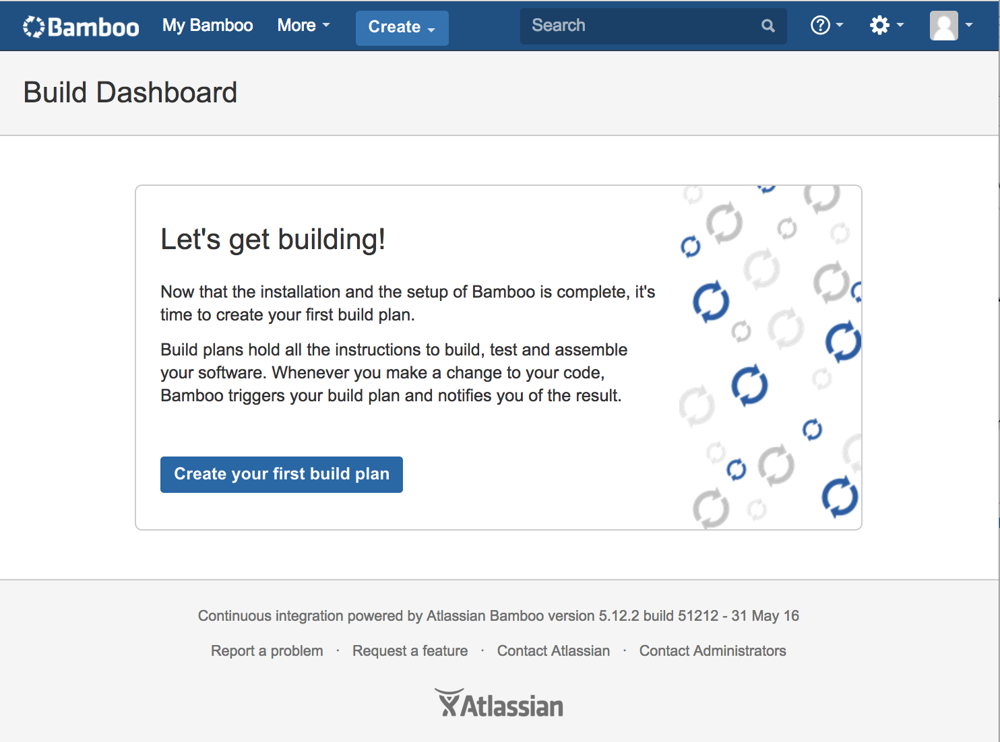
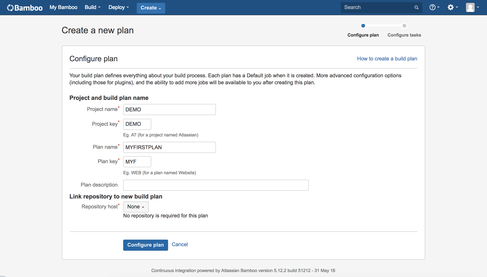
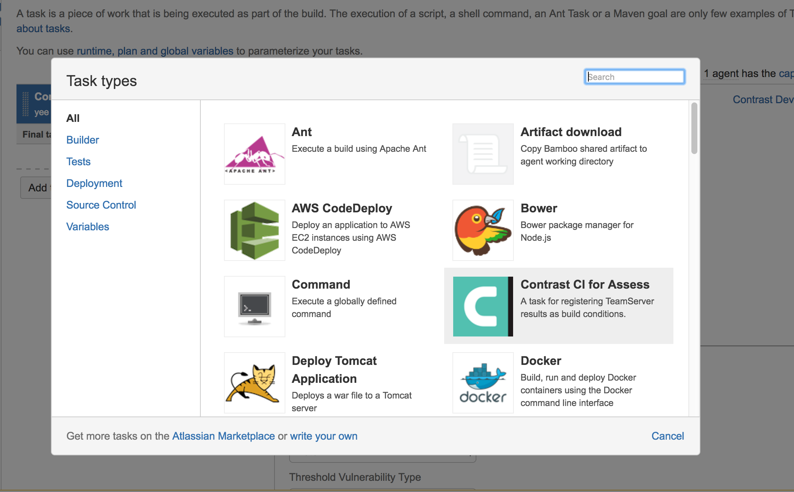
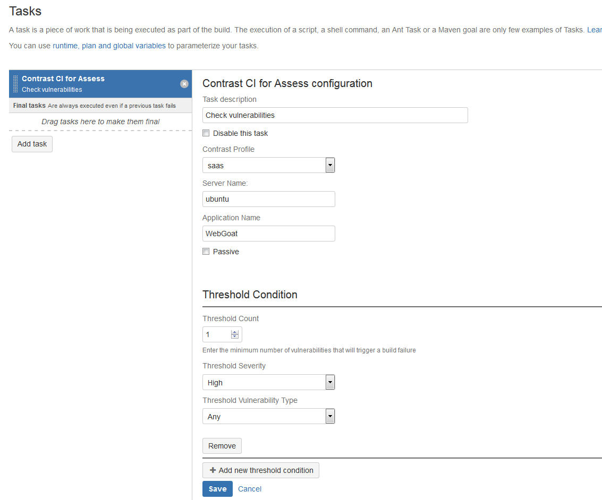
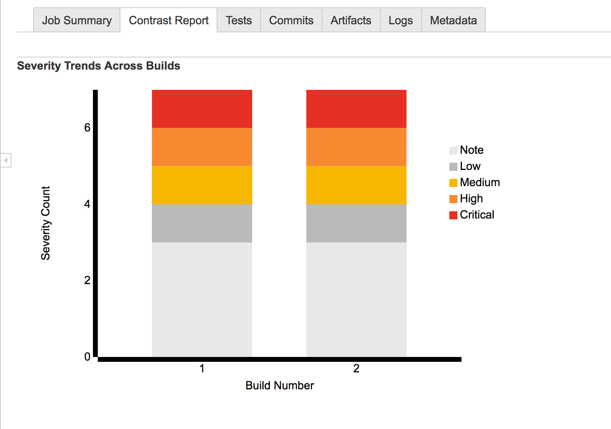

# Contrast Bamboo Plugin

The plugin adds the functionality to Bamboo for users to configure profiles for connecting to TeamServer and to verify builds against vulnerability thresholds.

## Installing
The first step is to build the plugin. To do so, clone the plugin from our Github [repository](https://github.com/Contrast-Security-OSS/contrast-bamboo-plugin.git).
```bash
git clone https://github.com/Contrast-Security-OSS/contrast-bamboo-plugin.git
cd contrast-bamboo-plugin
mvn package
```

This will build the `contrast-bamboo-plugin-#.#.#-SNAPSHOT.jar` and a .obr file.  They can be found within the `contrast-bamboo-plugin/target` directory of the cloned project.

Now that we have the built plugin we can upload it to our Bamboo instance.

First select the "Add Ons" option from the top left settings menu.


Then select the "Upload add-on" text.


You should now be prompted to upload a file. Select the `contrast-bamboo-plugin-#.#.#-SNAPSHOT.obr` file.

After the plugin has been upload you should see it appear under User Installed Add-Ons.



### Creating a TeamServer profile
In order to begin using the plugin you should first configure a TeamServer profile.
To do this go select the TeamServer Profiles button beneath the Add-Ons heading within the Bamboo Administration dashboard.


You will then be brought to the Profile Configuration page, select the New Profile button to be shown fields for adding a profile.

You should fill out the form fields according to their labels.
The Server Name that you enter should correspond to a server name that is on TeamServer.
If you are a SaaS customer you do **not** need to enter a TeamServer Url.
Once you have filled out all the fields you can select the Test Connection button to verify that your settings are correct.



### About Vulnerability Thresholds
The plugin can be added as a task to build jobs to check for vulnerability conditions that you configure.  This will check TeamServer for the number of vulnerabilities in the applications as well as types of vulnerabilities.

### Configuring Vulnerability Thresholds
To add a task to a build job you need to either create a new plan, or use an existing build plan. For the purpose of a walkthrough we will go through creating a new build plan.

Select the "Create a New Build Plan" button.


You will now be prompted to give the build plan a project name, plan name, and link to the repository host. The project key, and plan key will be auto-generated.



Once you create the plan you will be able to add a task to the build process, do so by clicking the "Add Task" button.


A popover menu will be presented, find the "Contrast CI for Assess" task and select it.



The task configuration screen relies on a TeamServer Profile(this is what we configured earlier) and an application name.  The application name must be on the server that you defined when creating the profile.

The other part of the task configuration is defining conditions for when to fail a build.  This involves entering 3 pieces of data.
* Threshold Count - The minimum number of findings required to fail the build
* Threshold Severity - The minimum, severity at which to count a finding towards the threshold count.
* Threshold Vulnerability Type - The type of finding required to count a finding towards a threshold count.
**Note:** Using the "Any" option, means that any severity or vulnerability type will be counted towards the max threshold count.

You can configure multiple conditions for each task by selecting the "Add New Threshold Condition" button.



The last step is to enable our build plan by selecting the checkbox in the bottom left.


### Running Our Build
To run our build for the first time you will need to select the "Run" button and then on the dropdown select the "Run Plan" option.

Once the build has ran, we will be able to see if it passed or failed.
To see the Contrast task details we can look at the logs of the job that the task is attached to. In our case, this is the default job. As we can see in the logs, the task only found 2 vulnerabilities that met our conditions so the job will pass.


The task also can give us some charts of the data by clicking the Contrast Report tab.
This will present the past 10 builds and chart the severities over build numbers, as well as the vulnerability types of build numbers.




